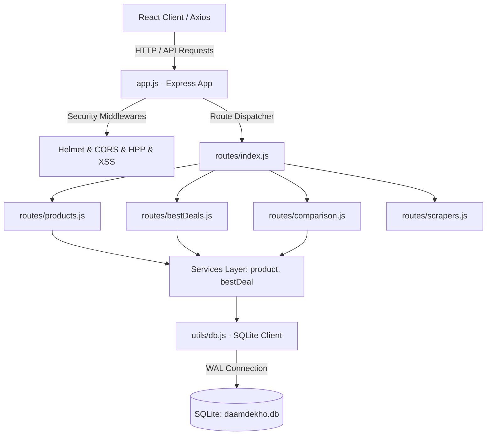

# ⚙️ Daam Dekho – Backend API & Relational Database Documentation

## 1. Executive Overview

The backend of **Daam Dekho** is an Enterprise-grade RESTful API server engineered with **Node.js**, **Express.js**, and an embedded **SQLite 3** relational database configured with High-Concurrency **Write-Ahead Logging (WAL)** mode.

It handles request routing, data querying across normalized schema tables, search indexing, best-deal scoring, affiliate URL resolution, price alert processing, and user authorization.

---

## 🏛️ 2. Architectural Blueprint



---

## 💾 3. Database Schema Specification (`daamdekho.db`)

The SQLite database uses **10 highly normalized relational tables** enforcing strict foreign key integrity:

```mermaid
erDiagram
    products_master ||--o{ product_variants : "has"
    product_variants ||--o{ product_specifications : "defines"
    product_variants ||--o{ vendor_products : "listed_on"
    vendors ||--o{ vendor_products : "sells"
    vendor_products ||--o{ price_history : "tracks"
    users ||--o{ wishlists : "saves"
    product_variants ||--o{ wishlists : "saved_in"
    users ||--o{ price_alerts : "sets"
    product_variants ||--o{ price_alerts : "alerted_on"

    products_master {
        INTEGER id PK
        TEXT title
        TEXT clean_title
        TEXT brand
        TEXT category
        TEXT subcategory
        TEXT model_name
        TEXT slug UNIQUE
        TEXT base_image
    }
    product_variants {
        INTEGER id PK
        INTEGER product_id FK
        TEXT ram
        TEXT storage
        TEXT color
        TEXT sku_code
        TEXT slug UNIQUE
    }
    product_specifications {
        INTEGER id PK
        INTEGER variant_id FK
        TEXT spec_key
        TEXT spec_value
    }
    vendor_products {
        INTEGER id PK
        INTEGER variant_id FK
        INTEGER vendor_id FK
        TEXT vendor_product_id
        TEXT title
        TEXT url UNIQUE
        REAL price
        REAL mrp
        REAL discount_percent
        REAL rating
        INTEGER reviews
        TEXT stock_status
        TEXT delivery_days
        TEXT seller
        TEXT offers
        TIMESTAMP last_scraped_at
    }
    price_history {
        INTEGER id PK
        INTEGER vendor_product_id FK
        REAL price
        TIMESTAMP recorded_at
    }
```

### Key Performance Pragmas Enabled:
```sql
PRAGMA journal_mode = WAL;
PRAGMA foreign_keys = ON;
PRAGMA synchronous = NORMAL;
```

---

## 📁 4. Directory Structure & Layer Responsibilities

```
app/backend-node/
├── app.js                    # Express app initialization, middleware stack, global error handler
├── server.js                 # Server entry point listening on PORT 5000
├── utils/
│   └── db.js                 # SQLite database connection manager & query helpers
├── routes/
│   ├── index.js              # Central API router aggregator (/api)
│   ├── products.js           # Catalog, pagination, product details, search APIs
│   ├── products_enhanced.js  # Advanced category filter APIs
│   ├── bestDeals.js          # /api/home and /api/best-deals endpoints
│   ├── comparison.js        # Multi-product comparison API endpoints
│   └── scrapers.js           # Trigger scraping execution from admin interface
├── controllers/
│   ├── productController.js  # Business logic for catalog queries
│   ├── authController.js     # User registration, login, JWT token emission
│   └── userController.js     # User wishlist & price drop alerts
├── services/
│   └── bestDealService.js   # Scoring algorithm to calculate top savings
└── tests/
    └── api.test.js           # Integration test suite (Jest + Supertest)
```

---

## 🌐 5. REST API Endpoints Reference

### 1. Catalog & Search Endpoints

| Method | Endpoint | Description | Query Parameters |
| :--- | :--- | :--- | :--- |
| `GET` | `/api/products` | Paginated product master list | `page`, `limit`, `category`, `brand`, `sort` |
| `GET` | `/api/products/:id` | Single product details with variants & vendor offers | `id` |
| `GET` | `/api/search` | Search product titles & specifications | `q` (search query) |
| `GET` | `/api/categories` | Distinct categories list with product counts | - |

### 2. Homepage & Best Deals Endpoints

| Method | Endpoint | Description |
| :--- | :--- | :--- |
| `GET` | `/api/home` | Aggregated payload for Home page (categories, featured carousel, top deals) |
| `GET` | `/api/best-deals` | Products sorted by highest percentage discount across vendors |

### 3. Comparison Endpoints

| Method | Endpoint | Description |
| :--- | :--- | :--- |
| `POST` | `/api/compare` | Takes array of variant IDs `[id1, id2]` and returns side-by-side spec matrix |

---

## 🔒 6. Security & Performance Guardrails

1. **CORS Security**: Restricted to whitelist origins (`http://localhost:5173`, production domains).
2. **Helmet Security Headers**: Configured Content Security Policy (CSP) allowing image loading from external vendor CDNs.
3. **Parameter Pollution & XSS Protection**: `hpp` and `xss-clean` middleware prevent parameter manipulation.
4. **WAL Mode Concurrency**: Allows concurrent readers while Python pipeline or background tasks write price updates without locking reads.

---

## 🧪 7. Testing & Verification

Run backend test suite:
```powershell
cd app/backend-node
npm test
```
* Executed with **Jest**. Verifies API smoke tests, health status, catalog pagination, 404 error boundaries, and SQLite connection stability.
