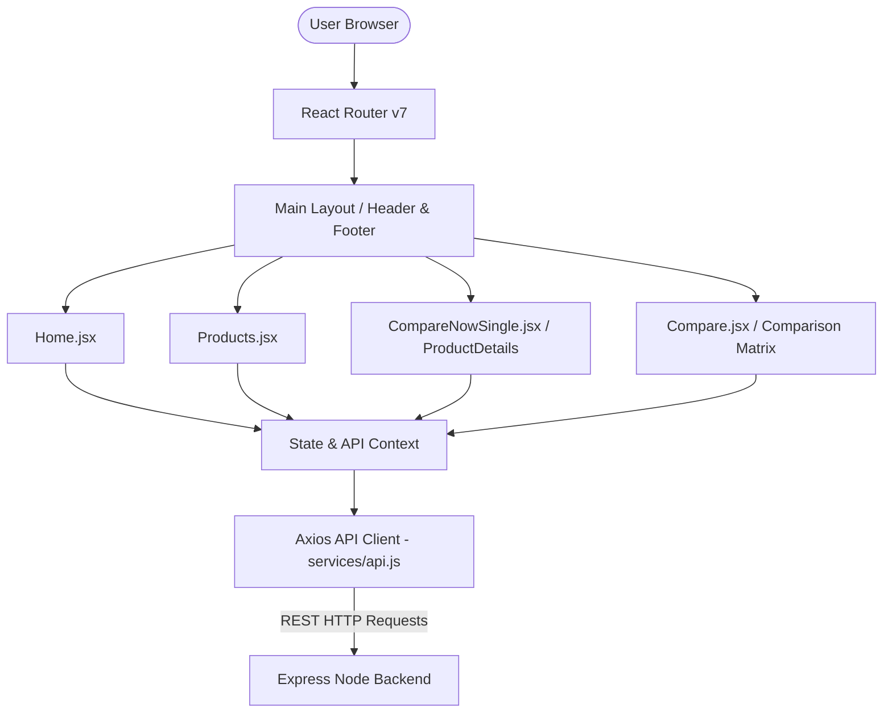

# 🎨 Daam Dekho – Frontend & UI/UX Design System Documentation

## 1. Executive Summary & Design Philosophy

**Daam Dekho** features a state-of-the-art, high-performance e-commerce price comparison interface built on top of **React 19**, **Vite 7**, and **Tailwind CSS v4**. 

The UI design is crafted with a **Modern Glassmorphism & High-Contrast Dark Mode** aesthetic. It prioritizes visual hierarchy, instantaneous feedback, smooth micro-interactions, and visual clarity across responsive breakpoints (Mobile, Tablet, Desktop, Ultra-wide).

---

## 🏛️ 2. Frontend Architecture & Technology Stack



### Core Technologies:
* **Framework**: React 19 (`react`, `react-dom`)
* **Build Tool**: Vite 7 (Lightning-fast HMR, optimized production bundling)
* **Styling**: Tailwind CSS v4 (`@tailwindcss/vite`), Custom Vanilla CSS Tokens
* **Icons**: React Icons (`react-icons/fi`, `react-icons/fa6`, `react-icons/hi2`)
* **Routing**: React Router v7 (`react-router-dom`)
* **Notifications**: React Hot Toast & React Toastify
* **Testing**: Vitest + React Testing Library + JSDOM

---

## 🎨 3. Design System & Aesthetics

### Color Palette Tokens
The platform uses a rich, dark-mode curated HSL color palette designed to look sleek and modern:

* **Primary Dark Background**: `#0f172a` (Slate 900)
* **Secondary Surface Card**: `#1e293b` (Slate 800) with `backdrop-blur-md` glass effect.
* **Accent Gold / Amber**: `#f59e0b` (Amber 500) for deal badges, ratings, and call-to-actions.
* **Vendor Brand Colors**:
  * **Amazon**: `#ff9900` (Amazon Orange)
  * **Flipkart**: `#2874f0` (Flipkart Blue)
  * **Croma**: `#00b9f5` (Croma Cyan)
  * **JioMart**: `#008ecc` (JioMart Royal Blue)
  * **Vijay Sales**: `#e31e25` (Vijay Sales Red)

### Typography
* Primary Font Family: **Inter / system-ui**
* Heading Font Family: **Outfit / Poppins**
* Features crisp letter-spacing and dynamic fluid text sizing (`text-xs` through `text-4xl`).

### Micro-Animations & Effects
* **Hover Scale Effects**: `hover:scale-105 transition-all duration-300`
* **Glassmorphism Border Glow**: `border border-slate-700/50 hover:border-amber-500/50 shadow-lg hover:shadow-amber-500/10`
* **Skeleton Loaders**: Custom pulse animations for instant perceived performance.

---

## 📁 4. Component Structure & Directory Layout

```
app/frontend/src/
├── App.jsx                   # Primary Router & Route Definitions
├── main.jsx                  # React Root mounting with Providers
├── index.css                 # Core CSS Design tokens & Utilities
├── assets/                   # Static logos, icons, vendor graphics
├── components/
│   ├── Header.jsx            # Sticky Navigation, Search bar, Category Dropdown
│   ├── Footer.jsx            # Platform Footer, Social links, Newsletter
│   ├── ScrollToTop.jsx       # Smooth page navigation scroll anchor
│   ├── category/             # Category carousel and pills
│   ├── compare/              # Specification matrix & comparison tables
│   ├── home/                 # Banner sliders, Top deals grid, Hero sections
│   └── product/              # Product cards, Vendor offer rows, Price history charts
├── pages/
│   ├── Home.jsx              # Landing Page with aggregated deal carousels
│   ├── Products.jsx          # Catalog filter page (Category, Price range, Brand)
│   ├── CompareNowSingle.jsx  # Single Product detail page with vendor offers
│   ├── Compare.jsx           # Multi-product spec comparison matrix page
│   └── ContactUs.jsx         # Support & Contact form
├── services/
│   └── api.js                # Axios REST API services & error interceptors
└── utils/
    └── formatters.js         # Currency (INR ₹), rating, percentage formatters
```

---

## 📄 5. Key Pages & Features Breakdown

### 1. Home Page (`Home.jsx`)
* **Hero Banner Carousel**: Interactive banner showcasing top price drops.
* **Categories Bar**: Horizontal scrollable list with icons for *Mobiles*, *Laptops*, *Wearables*, *Audio*.
* **Top Deals Section**: Live cards displaying product title, image, highest discount percentage, and vendor logos offering the lowest price.

### 2. Catalog & Filter Page (`Products.jsx`)
* **Side Filter Bar**: Filter products by Category, Brand (Apple, Samsung, iQOO, Dell, HP), Price Range slider, and Stock Availability.
* **Search & Sort Toolbar**: Sort by *Price: Low to High*, *Price: High to Low*, *Popularity*, or *Discount*.
* **Grid / List View Toggle**: Seamlessly switch between grid cards and detailed list rows.

### 3. Product Details Page (`CompareNowSingle.jsx`)
* **Master Product Header**: High-res image gallery, title, specs summary (RAM, Storage, Processor, Camera, Battery).
* **Vendor Price Comparison Table**: Lists Amazon, Flipkart, Croma, JioMart, Vijay Sales side-by-side with live prices, coupon discounts, stock status, delivery times, and direct affiliate redirect links.
* **Best Deal Highlight Badge**: Automatically calculates and highlights the **Lowest Price Vendor** with savings amount.
* **Price Drop Alert Modal**: Allows users to set target price notifications.

### 4. Spec Comparison Page (`Compare.jsx`)
* Multi-product comparison matrix comparing 2 to 4 products side-by-side across all key technical specifications.

---

## ⚡ 6. State Management & API Integration

### Axios Client Setup (`services/api.js`)
* Configured with base URL pointing to environment variable `VITE_API_BASE_URL` (defaults to `http://localhost:5000/api`).
* Automatic error interceptor handles network fallbacks, 404s, and toast notifications.

### Core API Service Hooks:
* `getHomeData()`: Fetches curated top deals and categories for the landing page.
* `getProducts(params)`: Queries paginated catalog with filter params (`category`, `brand`, `minPrice`, `maxPrice`, `search`).
* `getProductById(id)`: Fetches product master details, specification list, and vendor prices.
* `getBestDeals()`: Fetches products with discount percentage >= 15%.

---

## 🧪 7. Testing & Build Instructions

### Running Tests:
```powershell
cd app/frontend
npm test
```
* Executed via **Vitest** + **React Testing Library**. Verified component rendering for Navbar, Search bar, and Home page data fetching.

### Building for Production:
```powershell
cd app/frontend
npm run build
```
* Output is generated in `dist/` directory.

### Previewing Production Build:
```powershell
npm run preview
```
