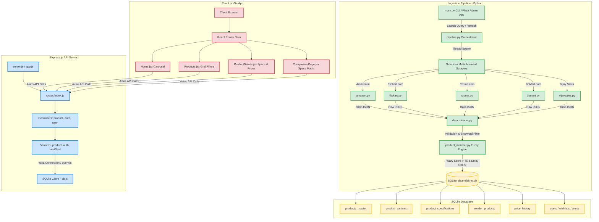

# Daam Dekho – Multi-Vendor Price Comparison & Deal Aggregator Platform
## System Architecture, Codebase walkthrough, and Production Technical Documentation

---

## 🚀 1. Executive Project Overview

**Daam Dekho** is an advanced, production-grade price comparison and e-commerce aggregation ecosystem designed to scrape, clean, match, and present product details across India's leading online retailers: **Amazon**, **Flipkart**, **Croma**, **JioMart**, and **Vijay Sales**.

The system addresses the primary challenge of e-commerce fragmentation: price disparity and varying promotional offers for identical products across different platforms. By building a unified catalog with fuzzy matching matching rules, Daam Dekho enables users to search for a product (e.g., smartphones or laptops) and instantly discover which vendor offers the absolute best price, current bank offers, EMI options, and real-time historical price drops.

### Core Goals:
1. **Parallelized Data Ingestion**: Scraping 5 platforms simultaneously using headless Selenium browsers with anti-scraping evasion.
2. **Unified Schema Resolution**: Normalizing raw, platform-specific unstructured tables into a relational database model.
3. **Fuzzy Entity Matcher**: Matching diverse seller listings (e.g., "Apple iPhone 15 Pro, Black, 128 GB" vs. "iPhone 15 Pro (128GB) - Black") to a single product master record using fuzzy text ratios and spec-mismatch checks.
4. **Premium REST API**: Serving paginated catalogs, smart search suggestions, category-level filters, price histories, user auth, wishlists, and price-drop alerts.
5. **Interactive React Client**: A state-of-the-art UI with responsive grid search, horizontal carousel filters, specs comparisons, and responsive glassmorphism styles.

---

## 🏛️ 2. Architectural Blueprint & Data Flow

The following diagram visualizes the overall architecture and data ingestion/consumption pathways of the Daam Dekho system:



---

## 💾 3. Database Schema Design (Unified vs. Legacy)

During its design evolution, the system transitioned from a **legacy approach** (storing raw scraped listings directly in flat vendor-specific tables inside `products.db`) to a **unified, relational database model** inside `daamdekho.db`. 

### The Legacy DB (`products.db`)
- Managed separate tables for each vendor: `amazon_products`, `flipkart_products`, `croma_products`, `jiomart_products`, and `vijaysales_products`.
- High redundancy: Titles, specifications, and images were repeated multiple times for each seller.
- Searching and comparisons required expensive `UNION` statements across five large tables.

### The Production DB Schema (`daamdekho.db`)
Consists of **10 highly normalized tables** enforcing strict integrity constraints:

```mermaid
erDiagram
    vendors {
        INTEGER id PK
        TEXT name UNIQUE
        TEXT base_url
        TEXT logo
        TEXT website
        TEXT affiliate_tag
        TEXT status
    }
    products_master {
        INTEGER id PK
        TEXT title
        TEXT clean_title
        TEXT brand
        TEXT category
        TEXT subcategory
        TEXT model_name
        TEXT slug UNIQUE
        TEXT base_image
        TIMESTAMP created_at
        TIMESTAMP updated_at
    }
    product_variants {
        INTEGER id PK
        INTEGER product_id FK
        TEXT ram
        TEXT storage
        TEXT color
        TEXT sku_code
        TEXT slug UNIQUE
        TIMESTAMP created_at
    }
    product_specifications {
        INTEGER id PK
        INTEGER variant_id FK
        TEXT spec_key
        TEXT spec_value
    }
    vendor_products {
        INTEGER id PK
        INTEGER variant_id FK
        INTEGER vendor_id FK
        TEXT vendor_product_id
        TEXT title
        TEXT url UNIQUE
        REAL price
        REAL mrp
        REAL discount_percent
        REAL rating
        INTEGER reviews
        TEXT stock_status
        TEXT delivery_days
        TEXT seller
        TEXT offers
        TIMESTAMP last_scraped_at
    }
    price_history {
        INTEGER id PK
        INTEGER vendor_product_id FK
        REAL price
        TIMESTAMP recorded_at
    }
    users {
        INTEGER id PK
        TEXT name
        TEXT email UNIQUE
        TEXT password_hash
        TEXT pincode
        TIMESTAMP created_at
    }
    wishlists {
        INTEGER id PK
        INTEGER user_id FK
        INTEGER variant_id FK
    }
    price_alerts {
        INTEGER id PK
        INTEGER user_id FK
        INTEGER variant_id FK
        REAL target_price
        INTEGER is_active
    }
    compare_logs {
        INTEGER id PK
        INTEGER user_id FK
        TEXT search_text
        TIMESTAMP created_at
    }

    products_master ||--o{ product_variants : "has"
    product_variants ||--o{ product_specifications : "defines"
    product_variants ||--o{ vendor_products : "listed_on"
    vendors ||--o{ vendor_products : "sells"
    vendor_products ||--o{ price_history : "tracks"
    users ||--o{ wishlists : "saves"
    product_variants ||--o{ wishlists : "saved_in"
    users ||--o{ price_alerts : "sets"
    product_variants ||--o{ price_alerts : "alerted_on"
    users ||--o{ compare_logs : "searches"
```

#### Table Definitions:
1. **`vendors`**: Static register of e-commerce partners (Amazon, Flipkart, etc.) with affiliate markers.
2. **`products_master`**: Core unified catalogue record representing a standard product line (e.g., Samsung Galaxy S24).
3. **`product_variants`**: Handles physical properties (RAM, Storage, Color options) for each master catalog item.
4. **`product_specifications`**: Key-value attribute definitions for a variant (e.g., "Screen Size" = "6.2 inches", "Processor" = "Exynos 2400").
5. **`vendor_products`**: Linking table pointing a specific variant to a specific vendor URL, storing the active scraped selling price, rating, reviews, stock, and promotional offers.
6. **`price_history`**: Tracks price movements over time. Used to render comparison graphs on the frontend.
7. **`users`**: Profile credentials with password hashes and custom PIN codes.
8. **`wishlists`**: Direct mapping of users to saved product variants.
9. **`price_alerts`**: Custom target trigger prices for automated notifications when items drop below user thresholds.
10. **`compare_logs`**: Search audit trails.

---

## ⚙️ 4. The Data Ingestion & Scraper Pipeline

Located in the `daam_dekho_scraper` directory, the ingestion workflow is an advanced Python script built around multiprocessing, multi-threading, and Selenium browser automation.

### 4.1 Pipeline Orchestration (`app/pipeline.py`)
The pipeline runs searches across all active e-commerce platforms in parallel:
- Spawns target scraper processes using python `threading.Thread` workers.
- Pulls scraping results into a concurrent `Queue`.
- Runs incoming products through the validation rules of the `DataCleaner`.
- Executes fuzzy comparisons via the `ProductMatcher` against existing entries.
- If a match is discovered, the listing is linked to the existing `products_master` and `product_variants` record.
- Otherwise, a new master and variant are inserted on the fly.
- Saves price listings to `vendor_products` and inserts current prices into the `price_history` database tables.
- **SQL Resiliency**: Implements an automatic retry loop (up to 5 attempts) to gracefully handle SQLite "database is locked" errors that can happen when concurrent threads write data simultaneously.

### 4.2 Base Evasion Scraper (`app/scrapers/base.py`)
To bypass strict anti-scraping systems (such as Amazon's and Flipkart's CDNs), `BaseScraper` sets up specialized ChromeDriver options:
- **Headless Mode**: Supports `--headless=new` for server deployments.
- **User-Agent Rotation**: Injects realistic rotating web browser identities.
- **Automation Evasion**: Adds `--disable-blink-features=AutomationControlled`, removes helper switches, and runs Chrome DevTools Protocol (CDP) commands to nullify `navigator.webdriver` variables.
- **Lazy Load Handler**: Automates viewport page scrolling (`window.scrollTo`) to trigger dynamic elements, script images, and delayed asset loaders.

### 4.3 Fuzzy Matching Engine (`app/matchers/product_matcher.py`)
Aggregating lists from multiple stores creates duplicate matches. The matcher solves this using a multi-step verification:
- **Title Normalization**: Converts to lowercase, removes network tags (5G, 4G), strips common symbols, standardizes units (e.g., `12 gb` to `12gb`), and drops promotional stop-words.
- **Entity Extraction**: Uses regex to extract RAM and Storage configurations from the cleaned title and specification structures.
- **RapidFuzz Score**: Employs `fuzz.token_set_ratio` to calculate base string similarity (Max 50 points) and checks for exact Brand matches (Max 35 points).
- **Hard Spec Penalty**: If both products specify RAM or ROM configurations, and they mismatch (e.g., 128GB vs. 256GB), the match is penalized by `-30 points` to prevent grouping different models together.
- **Accessory Safeguards**: Compares key phrases (like `case`, `cover`, `tempered`). If one product is an accessory and the other is a smartphone, a `-100 point` penalty is applied to guarantee accessories are never merged into mobile devices.

### 4.4 Data Cleaning Engine (`app/cleaners/data_cleaner.py`)
- **Price Normalizer**: Strips rupee symbols (`₹`), currency commas, and non-numeric content, converting strings to clean floating-point numbers.
- **Stopword Filtration**: Automatically validates item quality. Rejects listings with extremely short titles or non-positive prices, and filters out accessory products (chargers, tempered glass) from primary smartphone categories.

---

## 🌐 5. Backend Express.js Server Walkthrough

Located in `app/backend-node`, the server acts as a robust, secure middleware gateway fetching data from the normalized `daamdekho.db` file.

### 5.1 Entrypoint & Middlewares (`app.js`, `server.js`)
- Runs on port `8001`.
- **CORS Management**: In production mode, wildcards are rejected. The server dynamically checks requested origins against a strict whitelist (configured in process environment variables).
- **Security Protections**: Implements `helmet` (with comprehensive Content Security Policy directives supporting remote image loaders), `xss-clean` for request sanitization, and `hpp` to stop HTTP parameter pollution.
- **JWT Protection**: Restricts API user endpoints (Wishlists, Profile, PIN code updates, Price Alerts) using JWT signature verification middleware (`middleware/auth.js`).

### 5.2 Routing & Endpoints (`routes/index.js`)

| Method | Endpoint | Authorization | Description |
| :--- | :--- | :--- | :--- |
| **GET** | `/api/home` | Public | Aggregates landing page items: Top Category lists, Trending Deals (sorted by largest discount percentage), Hot Price Drops (discount > 30%), and Latest Arrivals. |
| **GET** | `/api/products` | Public | Comprehensive product search engine. Supports pagination, keyword match, category filtering, RAM/ROM spec parsing, brand checklists, and custom price range bounding. |
| **GET** | `/api/products/:slug` | Public | Deep details fetcher. Collects variant configurations, fetches the cheapest specific vendor listings, parses promotional lists, and selects four closely related category items. |
| **GET** | `/api/search/suggestions`| Public | Fast suggest autocomplete returning top-5 matching product names and thumbnails. |
| **GET** | `/api/categories` | Public | Fetches unique category list. |
| **GET** | `/api/brands` | Public | Fetches unique brand names. |
| **POST**| `/api/auth/register` | Public | Creates a user account. Hashes passwords using `bcrypt`. |
| **POST**| `/api/auth/login` | Public | Verifies credentials and generates JWT access keys. |
| **GET** | `/api/user/profile` | Protected | Fetches active user configuration and delivery PIN code. |
| **PUT** | `/api/user/pincode` | Protected | Updates custom PIN code for delivery calculations. |
| **GET** | `/api/user/wishlist` | Protected | Fetches all saved items for the active user session. |
| **POST**| `/api/user/wishlist` | Protected | Adds a variant item to the wishlist. |
| **DELETE**| `/api/user/wishlist/:id` | Protected | Deletes an item from the wishlist. |
| **GET** | `/api/user/alerts` | Protected | Lists user's active price-drop alert metrics. |
| **POST**| `/api/user/alerts` | Protected | Creates a new trigger alert for a specified target price. |

---

## 💻 6. Frontend React/Vite Application

Located in `app/frontend`, the client is a modular, fast Single Page Application (SPA) structured with React Router.

### 6.1 Core Layout & Styles
- **`Layout.jsx`**: Incorporates standard page setups, placing a sticky header navigation (with a dynamic search suggestions bar and wishlist count badge) at the top and a footer map at the bottom.
- **`index.css` / `App.css`**: Written using CSS modules and modern typography (using smooth CSS variables, harmonious HSL shades, dark elements, glassmorphism containers, and button animations).

### 6.2 Primary Routing Pages

```text
app/frontend/src/pages/
├── Home.jsx              # Landing dashboard showing hero sections, deal carousels, and products.
├── Products.jsx          # Catalog browser. Contains filter sidebar and layout controls.
├── Compare.jsx           # Entry page displaying compared items side-by-side.
├── CompareNowSingle.jsx  # Compact, user-focused comparison page.
├── ContactUs.jsx         # Support page containing structured form feedback submission.
└── Category.jsx          # Category collections view page.
```

### 6.3 State Management & Spec Comparison
- **`contexts/CompareContext.jsx`**: Global context provider storing list arrays of products chosen for comparison. Restricts selections to up to 4 items and synchronizes lists across routing transitions.
- **`components/compare/ComparisonPage.jsx`**: Dynamically renders a specs comparison matrix. Maps unified specifications keys (RAM, Storage, OS, Battery, Processor, Camera, weight) into a clean, comparative table grid highlighting the cheapest vendor option for each item.

---

## 🛠️ 7. Key Code Snippets & Logic Explanations

### 7.1 Database Connection (`app/backend-node/utils/db.js`)
This module initializes the SQLite database engine, enables Write-Ahead Logging (WAL) for concurrent read/write operations, and sets up promise-based helper functions:

```javascript
import sqlite3 from 'sqlite3';
import { fileURLToPath } from 'url';
import { dirname, join } from 'path';

const __filename = fileURLToPath(import.meta.url);
const __dirname = dirname(__filename);
const DB_PATH = join(__dirname, '../../../daamdekho.db');

let db = null;

export const connectDB = () => {
  return new Promise((resolve, reject) => {
    db = new sqlite3.Database(DB_PATH, (err) => {
      if (err) {
        console.error('❌ Database connection error:', err);
        reject(err);
      } else {
        db.run('PRAGMA journal_mode = WAL');
        db.run('PRAGMA foreign_keys = ON');
        console.log('✅ Database connected at:', DB_PATH);
        resolve(db);
      }
    });
  });
};
```

### 7.2 Fuzzy Match Logic (`daam_dekho_scraper/app/matchers/product_matcher.py`)
This is the core algorithmic component that resolves data duplication. It checks titles and specs, and applies penalties to prevent mismatch errors:

```python
def calculate_score(self, prod_a, prod_b):
    score = 0
    
    # 1. Title Similarity (Fuzzy)
    title_a = self.normalize_title(prod_a.get('title'))
    title_b = self.normalize_title(prod_b.get('title'))
    title_fuzz = fuzz.token_set_ratio(title_a, title_b)
    score += (title_fuzz * 0.5) # Max 50 points
    
    # 2. Brand Match
    brand_a = prod_a.get('brand', '').lower()
    brand_b = prod_b.get('brand', '').lower()
    if brand_a and brand_b:
        if brand_a == brand_b: score += 35 # Max 35 points
    
    # 3. Spec Matches
    specs_a = prod_a.get('specifications', {})
    specs_b = prod_b.get('specifications', {})
    
    ent_a = self.extract_entities(prod_a.get('title'), specs_a)
    ent_b = self.extract_entities(prod_b.get('title'), specs_b)
    
    if ent_a['ram'] and ent_b['ram']:
        if ent_a['ram'] == ent_b['ram']: score += 15
        else: score -= 30 # Stricter penalty for mismatch
        
    if ent_a['storage'] and ent_b['storage']:
        if ent_a['storage'] == ent_b['storage']: score += 15
        else: score -= 30
        
    # 4. Accessory Protection (CRITICAL)
    accessory_keywords = ['case', 'cover', 'protector', 'tempered', 'guard', 'skin', 'pouch', 'charger', 'cable', 'adapter']
    is_acc_a = any(kw in title_a for kw in accessory_keywords)
    is_acc_b = any(kw in title_b for kw in accessory_keywords)
    
    if is_acc_a != is_acc_b:
        score -= 100 # Huge penalty if one is an accessory and the other is not
        
    return score
```

### 7.3 Multi-threaded SQLite Resiliency (`daam_dekho_scraper/app/pipeline.py`)
To prevent concurrent writes from crashing the pipeline during large parallel scraping jobs, the database operation implements a sleep-retry loop:

```python
def _save_to_production_db(self, p, category):
    """Saves a product using the normalized schema with retries for locks."""
    import time
    max_retries = 5
    for attempt in range(max_retries):
        try:
            conn = db_manager.get_connection()
            cursor = conn.cursor()
            
            # Fuzzy match products & insert/update operations...
            # (Fuzzy lookup, variant creation, vendor product link, price history tracking)
            
            conn.commit()
            conn.close()
            return # Success
        except Exception as e:
            if "locked" in str(e).lower() and attempt < max_retries - 1:
                time.sleep(1) # Backoff for 1s
                continue
            logger.error(f"Pipeline DB Error: {e}")
            if 'conn' in locals(): conn.close()
            break
```

---

## 🏁 8. Quick Start Developer Guide

Follow these steps to launch the entire environment locally:

### Phase A: Setup and Run the Python Scraper
1. Navigate to the scraper directory:
   ```bash
   cd daam_dekho_scraper
   ```
2. Activate your virtual environment and install dependencies:
   ```bash
   python -m venv venv
   venv\Scripts\activate
   pip install -r requirements.txt
   ```
3. Run the interactive scraper CLI to ingest product data:
   ```bash
   python main.py
   ```
   *Enter a search term like `oneplus 12` to scrape listings, run cleanups, and populate the database.*

### Phase B: Launching the Express.js Backend API
1. Navigate to the backend directory:
   ```bash
   cd ../app/backend-node
   ```
2. Install npm packages:
   ```bash
   npm install
   ```
3. Initialize the database schema and migrate legacy data:
   ```bash
   npm run setup-db
   node database/migrate.js
   ```
4. Start the development server:
   ```bash
   npm run dev
   ```
   *API will start running at `http://localhost:8001`*

### Phase C: Launching the React Frontend
1. Navigate to the frontend directory:
   ```bash
   cd ../frontend
   ```
2. Install dependencies:
   ```bash
   npm install
   ```
3. Start the Vite hot-reloading dev server:
   ```bash
   npm run dev
   ```
   *Access the web application interface at `http://localhost:5173`*

---
*Document prepared for the engineering team. Internal use only.*
