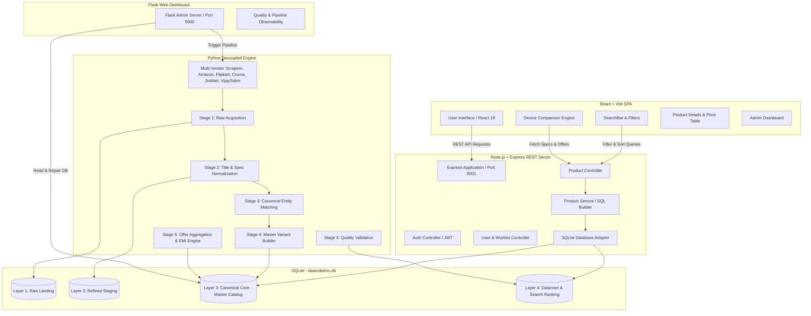
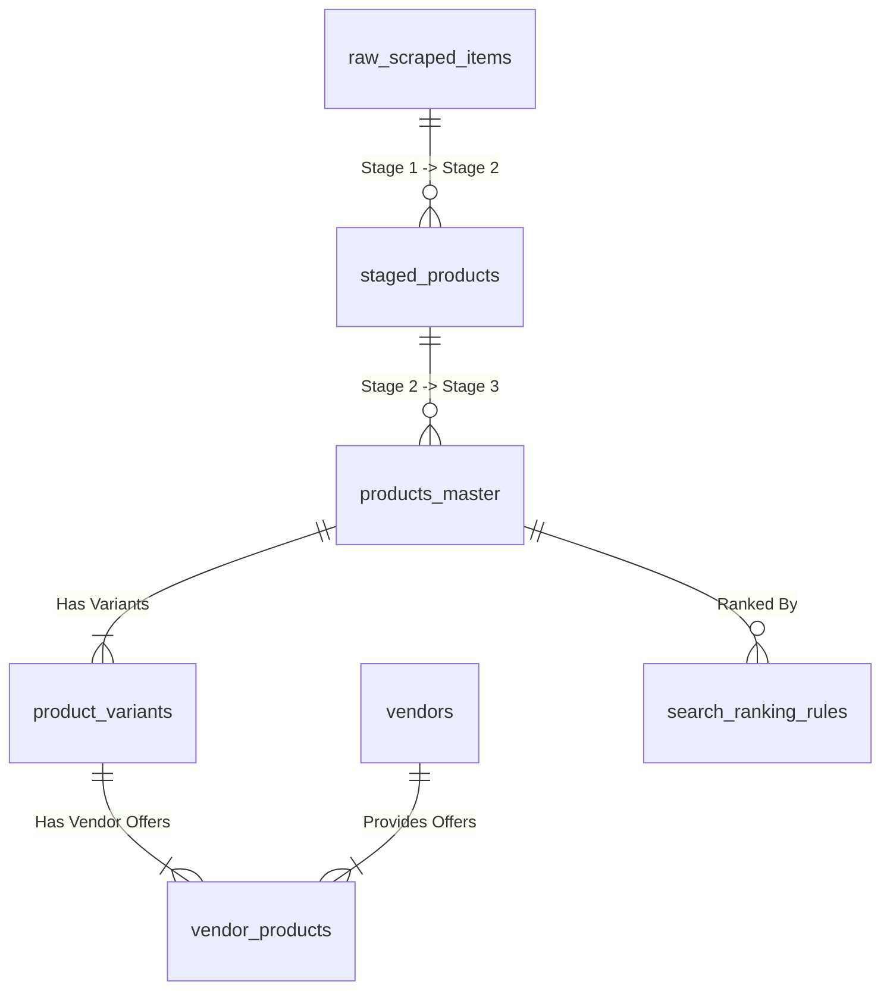
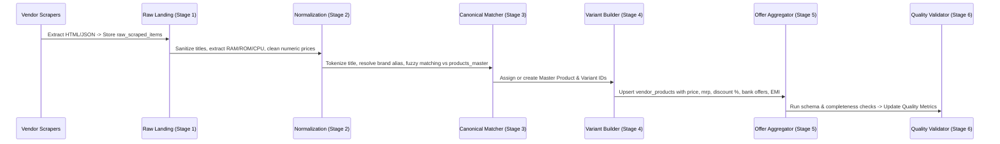

# DaamDekho Platform - Complete System Architecture & Technical Report

An end-to-end technical overview and codebase architecture report for **DaamDekho** — a multi-vendor e-commerce price comparison, affiliate marketing, and product intelligence platform.

---

## System Architecture Diagram



---

## 1. Executive Summary & Overview

**DaamDekho** is an Indian e-commerce price comparison platform designed to ingest, normalize, match, and present real-time product prices, specs, and bank offers across major retail vendors (**Amazon, Flipkart, Croma, JioMart, Vijay Sales**).

### Primary Capabilities:
1. **Multi-Vendor Scraping & Ingestion**: Resilient web scrapers using Playwright and BeautifulSoup to extract product titles, MRP, discounted prices, ratings, reviews, specs, and bank/EMI offers.
2. **Decoupled 4-Layer Data Lake**: Structured database schema in SQLite separating raw landing data, refined staging data, canonical master catalog entities, and search datamarts.
3. **Cross-Vendor Entity Matching**: Proprietary matching engine (`product_matcher.py`) combining brand alias resolution, model extraction, spec normalization, and string token distance algorithms to deduplicate products across vendors.
4. **Express Node.js REST API**: High-performance backend providing search, autocomplete, filtering, product specs breakdown, vendor price comparison matrices, sitemap, and authentication.
5. **Modern React Frontend**: Fast, responsive Vite single-page application featuring side-by-side device comparison, specs breakdown, price history, and responsive layout.
6. **Flask Admin Dashboard**: Integrated administration portal for triggering scraper pipelines, inspecting database health, executing repairs, and reviewing daily quality metrics.

---

## 2. Codebase Structure & Component Breakdown

```text
daam_dekho_final/
├── app/
│   ├── backend-node/                 # Express.js REST API Server
│   │   ├── controllers/              # Request handlers (productController, authController, userController)
│   │   ├── middleware/               # Auth middleware, security, input validators
│   │   ├── routes/                   # Route definitions (/api/home, /api/products, /api/search/suggestions)
│   │   ├── services/                 # Business logic & SQL query builder (productService)
│   │   ├── utils/                    # Database connection (sqlite3 promise wrapper)
│   │   ├── app.js                    # Express app configuration & middleware
│   │   └── server.js                 # Server entry point (Port 8001)
│   │
│   └── frontend/                     # React 19 + Vite Single Page Application
│       ├── src/
│       │   ├── components/           # UI Component hierarchy
│       │   │   ├── category/         # Category cards & browsing
│       │   │   ├── compare/          # Side-by-side comparison tables & spec sections
│       │   │   ├── home/             # Homepage sections, search bar, trending cards
│       │   │   ├── product/          # Product details, specs grid, vendor price matrix, EMI modal
│       │   │   └── products/         # Grid view, sidebar filters, rating stars, pagination
│       │   ├── contexts/             # ThemeContext, CompareContext
│       │   ├── pages/                # Home, Products, Compare, Category, ProductDetails
│       │   ├── services/             # Axios API client setup (api.js)
│       │   ├── App.jsx               # React Router configuration
│       │   └── main.jsx              # React DOM entry point
│       └── package.json              # Vite, TailwindCSS, Vitest dependencies
│
├── daam_dekho_scraper/               # Python Scraping & ETL Data Lake Engine
│   ├── admin_app/                    # Flask Admin Web Dashboard
│   │   ├── run_admin.py              # Flask server launcher (Port 5000)
│   │   ├── app.py                    # Flask application setup
│   │   └── routes.py                 # Admin dashboard routes & metrics API
│   ├── app/
│   │   ├── adapters/                 # Vendor-specific payload normalizers
│   │   ├── cleaners/                 # Data cleaners & spec sanitizers
│   │   ├── database/                 # SQLite manager & 4-layer Data Lake schema
│   │   ├── etl/                      # 6-stage decoupled ETL orchestrator & pipeline stages
│   │   ├── extractors/               # Spec extractor (RAM, ROM, CPU, Camera, Display)
│   │   ├── matchers/                 # Product matching & cross-vendor deduplication engine
│   │   ├── scrapers/                 # Amazon, Flipkart, Croma, JioMart, VijaySales scrapers
│   │   ├── formatter.py              # Data formatting & canonical title generation
│   │   ├── pipeline.py               # Main scraper pipeline controller
│   │   └── scheduler.py              # Background scraping scheduler
│   ├── cli.py                        # Scraper Command Line Interface
│   └── tests/                        # Pytest unit tests (test_formatter.py)
│
├── create_ranking_rules_table.py     # Database search ranking rules seeder
├── empty_database.py                 # Database table reset tool
├── generate_daily_quality_report.py  # Daily quality report generator
├── run_real_production_pipeline.py  # Production multi-vendor pipeline entrypoint
├── run_v10_local_etl_test.py         # Local ETL CLI testing runner
└── daamdekho.db                      # Primary SQLite Production Database
```

---

## 3. Database Architecture (4-Layer Data Lake Schema)

The database `daamdekho.db` is built around a **Decoupled 4-Layer Data Lake Architecture** designed to isolate raw scraping data from downstream consumption layers.



### Layer Details:

| Layer | Table Name | Purpose & Structure |
| :--- | :--- | :--- |
| **Layer 1: Raw Landing** | `raw_scraped_items` | Stores unparsed, raw HTML and JSON payloads directly from vendor scrapers. Contains `id`, `vendor`, `raw_payload`, `scraped_at`, `status`. |
| **Layer 2: Refined Staging** | `staged_products` | Intermediate table storing cleaned specs, sanitized titles, numeric prices, extracted RAM/ROM, and initial category tags. |
| **Layer 3: Canonical Core** | `products_master` | Primary canonical product entity. Stores `id`, `canonical_title`, `brand`, `category`, `base_image`, `created_at`. |
| **Layer 3: Variants** | `product_variants` | Stores SKU variant details: `id`, `product_id`, `color`, `ram`, `storage`, `variant_sku`. |
| **Layer 3: Vendor Offers** | `vendor_products` | Links vendor prices to specific variants: `id`, `variant_id`, `vendor_id`, `seller_name`, `price`, `mrp`, `discount_percent`, `product_link`, `rating`, `reviews`, `bank_offers_json`, `emi_schemes_json`, `last_scraped_at`. |
| **Layer 3: Vendors Metadata** | `vendors` | Vendor registry containing `id` (amazon, flipkart, croma, jiomart, vijaysales), `name`, `logo_url`, `is_active`. |
| **Layer 4: Datamart** | `search_ranking_rules` | Search boost table mapping categories and brand rules to `priority_weight` multipliers for search relevance. |

---

## 4. Web Scraping & Decoupled ETL Engine

The scraping system inside `daam_dekho_scraper/app/` follows a **6-stage decoupled ETL pipeline architecture**:



### Key Scraper Implementations:
- **Amazon (`amazon.py`)**: Handles Amazon search results and product detail pages (PDP). Resolves ASIN, extracts bullet specifications, rating count, and deal badges.
- **Flipkart (`flipkart.py`)**: Extracts FSN, title specs, price discounts, and specification tables.
- **Croma (`croma.py`)**: Ingests product cards, technical specs grid, and current store availability.
- **JioMart (`jiomart.py`)**: Parses JSON responses and product listings for mobile and electronics categories.
- **Vijay Sales (`vijaysales.py`)**: Extracts offer badges, instant bank discounts, and EMI monthly breakdowns.
- **Base Scraper (`base.py`)**: Provides user-agent rotation, proxy stealth headers, exponential backoff retries, and network timeout protection.

---

## 5. Express Node.js REST API Backend

The Node.js Express server (`app/backend-node/`) acts as the high-speed read layer serving data to the React frontend.

### REST API Endpoints Summary:

| Method | Endpoint | Description | Auth Required |
| :--- | :--- | :--- | :--- |
| `GET` | `/health` | Server health check endpoint | No |
| `GET` | `/api/home` | Returns home page collections (trending deals, hot price drops, latest products, categories) | No |
| `GET` | `/api/products` | Paginated product search with category, brand, price range, RAM, storage filters, and sorting | No |
| `GET` | `/api/products/:slug` | Detailed canonical product view including all vendor price offers, specs breakdown, and bank offers | No |
| `GET` | `/api/search/suggestions` | Fast autocomplete search suggestion endpoint | No |
| `GET` | `/api/categories` | Distinct product categories list | No |
| `GET` | `/api/brands` | Distinct product brands list | No |
| `GET` | `/api/filter-options` | Dynamic filter boundaries (min/max price, available RAM/storage options) | No |
| `POST` | `/api/auth/register` | User account registration | No |
| `POST` | `/api/auth/login` | User login (returns JWT token) | No |
| `GET` | `/user/profile` | Authenticated user profile details | Yes (JWT) |
| `GET` | `/user/wishlist` | User saved wishlist items | Yes (JWT) |
| `POST` | `/user/wishlist` | Add item to user wishlist | Yes (JWT) |
| `DELETE` | `/user/wishlist/:id` | Remove item from wishlist | Yes (JWT) |
| `GET` | `/sitemap.xml` | SEO XML sitemap generator | No |
| `GET` | `/robots.txt` | Crawler directives file | No |

---

## 6. React Frontend Application

The frontend (`app/frontend/`) is a responsive single-page application built using **React 19, Vite, React Router v7, and TailwindCSS**.

### Key UI Features:
1. **Interactive Search & Autocomplete**: Features live search with instant query suggestions, spell correction, and category auto-filtering.
2. **Product Details & Vendor Price Matrix (`Specs.jsx`, `Prices.jsx`)**: Displays the master product image carousel, comprehensive specifications table, and a price comparison matrix listing every vendor offering the product with direct affiliate store links.
3. **Side-by-Side Device Comparison (`Compare.jsx`, `ModernCompareView.jsx`)**: Allows users to compare 2 or more smartphones/laptops side-by-side across display, performance, camera, battery, design, network, and price.
4. **Bank Offers & EMI Modal (`OffersAndEmiModal.jsx`)**: Interactive modal showcasing bank credit card discounts, cashback offers, and monthly EMI options calculated per vendor.
5. **Responsive Sidebar Filters (`SidebarFilters.jsx`)**: Price range sliders, brand checkboxes, RAM/Storage selectors, and rating filters.

---

## 7. Operational Entrypoints & Administrative Tools

The platform provides a streamlined set of CLI scripts and admin tools:

1. **`run_real_production_pipeline.py`**:
   - Master production entrypoint that executes the full scraping, ETL normalization, canonical matching, and database ingestion pipeline.
2. **`run_v10_local_etl_test.py`**:
   - Developer CLI tool for testing the ETL pipeline against specific queries (e.g., `python run_v10_local_etl_test.py --query "iPhone 15" --category "Mobiles"`).
3. **`generate_daily_quality_report.py`**:
   - Evaluates overall database health, catalog coverage, missing spec ratios, and price freshness, generating `daily_quality_report.json`.
4. **`create_ranking_rules_table.py`**:
   - Database seeder that sets up search priority weights across categories.
5. **`empty_database.py`**:
   - Safe utility to clear database tables without dropping table schemas.
6. **Flask Admin Dashboard (`daam_dekho_scraper/admin_app/run_admin.py`)**:
   - Web application running on Port 5000 for visual monitoring, running manual scrapes, and reviewing data quality metrics.

---

## 8. Summary of Automated Testing

The codebase includes automated test suites across all layers:
- **Backend Node Tests**: Executed via Jest (`npm test` in `app/backend-node`) — verifies REST endpoint health, 404 handling, and product routes.
- **Frontend Unit Tests**: Executed via Vitest (`npm test` in `app/frontend`) — verifies component rendering and error states.
- **Scraper Unit Tests**: Executed via Pytest (`pytest` in `daam_dekho_scraper`) — verifies spec extraction, title formatting, and price sanitization routines.
