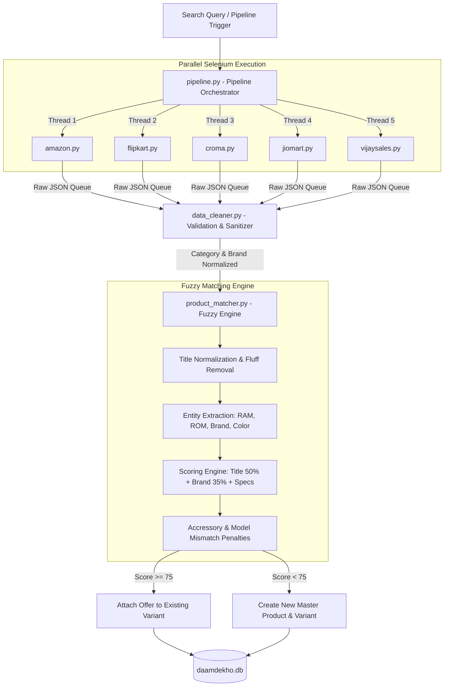

# 🕷️ Daam Dekho – Scraping Architecture & Fuzzy Product Matching Engine

## 1. Executive Summary

The ingestion engine of **Daam Dekho** is an automated, parallelized data scraping and entity resolution pipeline built in Python. 

It harvests live e-commerce listings across India's 5 major online electronics retailers (**Amazon**, **Flipkart**, **Croma**, **JioMart**, **Vijay Sales**), cleans unstructured raw HTML data, extracts key technical specifications, and executes a **Fuzzy Entity Matching Algorithm** to unite identical products under a single Master Record in the production database.

---

## 🏛️ 2. End-to-End Pipeline Architecture

---

## 🔍 3. Vendor Scraper Implementation Details

Each vendor has a dedicated scraper module inside `daam_dekho_scraper/app/scrapers/`:

### 1. Amazon India (`amazon.py`)
* **Strategy**: Headless Chrome with customized User-Agent strings.
* **Selectory Target**: Scrapes product title (`s-title-instructions-style`), price (`a-price-whole`), ratings (`a-icon-alt`), image URLs (`s-image`), and detail page link (`a-link-normal`).
* **Anti-Bot Strategy**: Disables automation flags (`--disable-blink-features=AutomationControlled`), uses random delays between paginated requests.

### 2. Flipkart (`flipkart.py`)
* **Strategy**: Dynamic CSS selector matching for grid and list product cards.
* **Target Selectors**: Title (`div._4rR01T` or `a.IRyBsX`), price (`div._30jeq3`), MRP (`div._3I9_wc`), discount (`div._3Ay6B5`).

### 3. Croma (`croma.py`)
* **Strategy**: Intercepts render elements and parses specification text (RAM, ROM, Processor) directly from search listing cards.

### 4. JioMart (`jiomart.py`)
* **Strategy**: Dynamic page scrolling + fallback JavaScript DOM extractor (`extract_jiomart.js`) to parse shadow DOM elements.

### 5. Vijay Sales (`vijaysales.py`)
* **Strategy**: Directly parses product titles, discount badges, ratings, and specification tags.

---

## 🧹 4. Data Cleaning & Normalization (`data_cleaner.py`)

Before product matching occurs, incoming scraped listings pass through strict sanitization:

1. **Price Normalization**: Converts strings like `"₹1,24,999.00"` to float `124999.0`. Removes currency symbols, commas, and invalid non-numeric text.
2. **Brand Normalization**: Maps variations (`"apple inc"`, `"iphone"`) to standard brand names (`"Apple"`).
3. **Category Detection**: Dynamically inspects title keywords to route items into **Mobiles**, **Laptops**, **Mobile Accessories**, or **Laptop Accessories**.
4. **Validation Filter**: Rejects listings missing title, URL, or valid price.

---

## 🧠 5. Fuzzy Product Matching Engine (`product_matcher.py`)

The core innovation of Daam Dekho is its **Fuzzy Entity Matcher**, which prevents duplicate product entries for listings across different stores.

### A. Title Normalization
* Lowercases title text.
* Standardizes units: converts `"128 gb"`, `"128-gb"`, `"128gb"` to uniform `"128gb"`.
* Strips marketing fluff words: `"brand new"`, `"latest model"`, `"fast delivery"`, `"special offer"`, `"genuine"`.
* Removes non-alphanumeric special characters.

### B. Entity & Spec Extraction
Extracts core specifications from both structured specs and unstructured titles:
* **RAM**: Matches patterns like `(\d+gb)`
* **Storage**: Matches storage capacity `(\d+(?:gb|tb))`
* **Brand & Processor**: Regex extraction for M1/M2/M3, Snapdragon, Bionic.

### C. Multi-Factor Scoring Algorithm
The match score between a candidate product $A$ and existing master $B$ is computed as follows:

$$\text{Total Score} = \text{Score}_{\text{title}} + \text{Score}_{\text{brand}} + \text{Score}_{\text{specs}} - \text{Penalties}$$

1. **Fuzzy Title Similarity (Max 50 points)**:
   Uses `rapidfuzz.fuzz.token_set_ratio` on normalized titles:
   $$\text{Score}_{\text{title}} = \text{token\_set\_ratio}(\text{title}_A, \text{title}_B) \times 0.5$$

2. **Brand Matching (Max 35 points)**:
   If $\text{brand}_A == \text{brand}_B$, add $+35$ points.

3. **Specification Alignment (+15 / -30 points)**:
   * RAM match: $+15$ points | RAM mismatch: $-30$ points
   * Storage match: $+15$ points | Storage mismatch: $-30$ points

4. **Accessory Protection Guardrail (-100 Penalty)**:
   Prevents cases like an **iPhone 15 Pro Max Case / Glass** from matching with the **iPhone 15 Pro Max Mobile Phone**. If one item contains accessory keywords (`cover`, `case`, `tempered`, `screen guard`) and the other does not, a **$-100$ point penalty** is immediately applied.

5. **iPhone Model Version Protection (-120 Penalty)**:
   Strict check for iPhone model numbers (e.g. iPhone 11 vs iPhone 15). If model numbers differ, a **$-120$ point penalty** is applied.

### D. Threshold Decision Rule
* **Score $\ge 75$**: Product is declared a **Match**. The vendor offer is linked to the existing `product_variant` in `daamdekho.db`.
* **Score $< 75$**: Product is declared a **New Entry**. A new record in `products_master` and `product_variants` is created.

---

## ⚙️ 6. Database Pipeline Integration (`pipeline.py`)

* **Parallel Scraping Queue**: Spawns concurrent threads for all selected scrapers using Python `threading` and `queue.Queue`.
* **Database Connection Manager**: Uses lock retries to safely insert records into SQLite WAL database without deadlocks.
* **Price History Tracking**: Every time a vendor price is scraped, a timestamped record is recorded in `price_history` to enable historical price drop charts.
